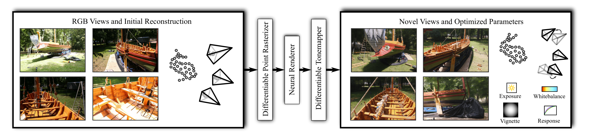
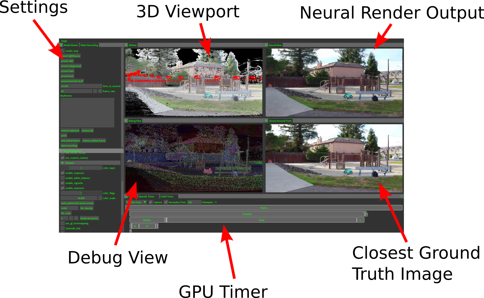

# ADOP: Approximate Differentiable One-Pixel Point Rendering

<div style="text-align: center;">Darius Rückert, Linus Franke, Marc Stamminger</div>




**Abstract:** We present a novel point-based, differentiable neural rendering pipeline for
scene refinement and novel view synthesis. The input are an initial estimate of
the point cloud and the camera parameters. The output are synthesized images
from arbitrary camera poses. The point cloud rendering is performed by a
differentiable renderer using multi-resolution one-pixel point rasterization.
Spatial gradients of the discrete rasterization are approximated by the novel
concept of ghost geometry. After rendering, the neural image pyramid is passed
through a deep neural network for shading calculations and hole-filling. A
differentiable, physically-based tonemapper then converts the intermediate
output to the target image. Since all stages of the pipeline are
differentiable, we optimize all of the scene's parameters i.e. camera model,
camera pose, point position, point color, environment map, rendering network
weights, vignetting, camera response function, per image exposure, and per
image white balance. We show that our system is able to synthesize sharper and
more consistent novel views than existing approaches because the initial
reconstruction is refined during training. The efficient one-pixel point
rasterization allows us to use arbitrary camera models and display scenes with
well over 100M points in real time.

[[Paper]](https://arxiv.org/abs/2110.06635) [[Youtube]](https://www.youtube.com/watch?v=WJRyu1JUtVw) [[Supplementary Material]](https://zenodo.org/record/5602606)

<a href="https://www.youtube.com/watch?v=WJRyu1JUtVw"> </a>


## Compile Instructions

 * ADOP is implemented in C++/CUDA using libTorch.
 * A python wrapper for pyTorch is currently not available. Feel free to submit a pull-request on that issue.
 * The detailed compile instructions can be found here: [src/README.md](src/README.md)

## Running ADOP on pretrained models

After a successful compilation, the best way to get started is to run `adop_viewer` on the *tanks and temples* scenes using our pretrained models.
First, download the [scenes](https://zenodo.org/record/5602606/files/scenes.zip?download=1) and extract them into `ADOP/scenes`. 
Now, download the [model checkpoints](https://zenodo.org/record/5602606/files/experiments.zip?download=1) and extract them into `ADOP/experiments`.
Your folder structure should look like this:
```shell
ADOP/
    build/
        ...
    scenes/
        tt_train/
        tt_playground/
        ...
    experiments/
        2021-10-15_08:26:49_multi_scene/
        ...
```


## ADOP Viewer

The `adop_viewer` can now be run by passing the path to a scene. 
It will automatically search for fitting pretrained models in the `experiments/` directory.
For example:
```shell
cd ADOP
./build/bin/adop_viewer --scene_dir scenes/boat
```

 * The working dir of `adop_viewer` must be the ADOP root directory. This is required because the shaders and experiments are search on relative paths. 
 * The most important keyboard shortcuts are:
    * F1: Switch to 3DView
    * F2: Switch to neural view
    * F3: Switch to split view (default)
    * WASD: Move camera
    * Center Mouse + Drag: Rotate around camera center
    * Left Mouse + Drag: Rotate around world center
    * Right click in 3DView: Select camera
    * Q: Move camera to selected camera

 

## ADOP VR Viewer

We have implemented **experimental** VR support using OpenVR/SteamVR. 
Checkout src/README.md for the compilation requirements.
```shell
cd ADOP
./build/bin/adop_vr_viewer --scene_dir scenes/tt_playground
```
 * Tune the `render_scale` settings for a compromise between FPS and resolution
 * Requires a high-end GPU to run reasonable 
 * Hopefully will be optimized in the future :)


## HDR Scenes

ADOP supports HDR scenes due to the physically-based tone mapper.
The input images can therefore have different exposure settings.
The dynamic range of a scene is the difference between the smallest and largest EV of all images.
For example, our boat scene (see below) has a dynamic range of ~10 stops.
If you want to fit ADOP to your own HDR scene consider the following:

 * For small dynamic ranges (<4) you can use the default pipeline.
 * For scenes with a large dynamic range, change to the log texture format and reduce the texture learning rate. Use the train config of our boat scene as reference.
 * Check if an initial EV guess is available. Many cameras store the exposure settings in the EXIF data.
 * Set the scene EV in the dataset.ini to the mean EV of all frames. This keeps the weights in a reasonable range.
 
When viewing HDR scenes in the `adop_viewer` you can press [F7] to open the tone mapper tab.
Here you can change the exposure value of the virtual camera.
In the render settings you find an option to use OpenGL based tone mapping instead of the learned on.

https://user-images.githubusercontent.com/16142878/138316754-ef8b2a8a-d421-4542-9b7b-4ee86bd15e97.mp4

## Scene Description
 * ADOP uses a simple, text-based scene description format.
 * To run ADOP on your scenes you have to convert them into this format.
 * After that you run adop_scene_preprocess to precompute various parameters.
 * If you have created your scene with COLMAP (like us) you can use the colmap2adop converter.
 * More infos on this topic can be found here: [scenes/README.md](scenes/README.md)

## Training ADOP
The ADOP pipeline is fitted to your scenes by the `adop_train` executable.
All training parameters are stored in a separate config file. 
The basic syntax is:
```shell
cd ADOP
./build/bin/adop_train --config configs/train_boat.ini
```
Make again sure that the working directory is the ADOP root.
Otherwise, the loss models will not be found.

#### Parameters

In `ADOP/configs/` you will find the train configurations files that we used to create the pretrained models.
We recommend to start with one these for your scenes.
 * Choose `configs/train_boat.ini` as a starting point, if your scene has been captured with a high variation of exposure values. (> 5 Stops)
 * Choose `configs/train_tank_and_temples_multi.ini` as a starting point for indoor scenes or if the images have a similar exposure value.

#### Memory Consumption

Both of our reference training config files were created for a 40GB A100 GPU.
If you run these on a lower-end GPU you will most likely run out of memory.
The important config params that control memory consumption are:
```shell
# Settings for 40GB A100
# Size in pixels of the random crop during training
train_crop_size = 512
# How many crops are taken per image
inner_batch_size = 4
# How many images are batched together. One batch will have inner_batch_size x batch_size = 16 crops!
batch_size = 4
```

```shell
# Settings for 12GB Titan V
train_crop_size = 256
inner_batch_size = 8
batch_size = 2
```

Additionally, you will find that the point cloud size will also have a significant impact on memory consumption.
On 12GB cards, we recommend to process only point clouds up to 100M points.
Otherwise, the batch size will be too small for good results.

#### Duration

As you can see in `configs`, we usually train for 400 epochs. 
This will take between 12-24h depending on scene size and training hardware.
However, after 100 epochs (3-6h) the novel view synthesis already works very well.
You can use this checkpoint in the `adop_viewer` to check if everything is working.

## Camera Models

ADOP currently supports two different camera models. 
The [Pinhole/Distortion](https://docs.opencv.org/4.5.4/d9/d0c/group__calib3d.html) camera model 
and the [Omnidirectional](https://sites.google.com/site/scarabotix/ocamcalib-omnidirectional-camera-calibration-toolbox-for-matlab?authuser=0) camera model. 

#### Pinhole/Distortion Camera Model

 * The default model for photogrammetry software like COLMAP, Metashape and Capture Reality.
 * Our implementation is found here: [Pinhole Part](https://github.com/darglein/saiga/blob/master/src/saiga/vision/cameraModel/Intrinsics4.h) and [Distortion Part](https://github.com/darglein/saiga/blob/master/src/saiga/vision/cameraModel/Distortion.h)

#### Omnidirectional Camera Model

 * A fisheye camera model extreme wide-angle angles.
 * Our implementation is found here: [Model](https://github.com/darglein/saiga/blob/master/src/saiga/vision/cameraModel/OCam.h)

#### Extending ADOP with other Camera Models

 1. Implement the camera model and its derivative. The derivative should be returned as the Jacobian matrix.
 2. Implement the forward and backward projection function [here](src/lib/rendering/PointRendererHelper.h).
 3. Add a new type [here](src/lib/data/SceneData.h), update the [rasterization code](src/lib/rendering/PointRenderer.cu) and the [wrapper code](src/lib/data/NeuralStructure.h).

## Supplementary Material

[](https://doi.org/10.5281/zenodo.5602606)

The supplementary material is published on Zenodo:

https://zenodo.org/record/5602606

This directory includes:

 * videos.zip
      * Additional separated video clips of the scenes.
      * Full-HD, 60 FPS
 * colmap.zip
      * The COLMAP reconstructions of our 5 scenes (boat + 4 tanks and temple scenes)
      * Includes triangle meshes to compare other approaches.
 * scenes.zip
      * The preprocessed scenes in our scene format
      * Required to run the pretrained model
 * experiments.zip
      * The pretrained models for all 5 scenes.
      * The 4 tanks and temples scenes were trained simultaneously and are therefore combined into a single experiment. They also share the same rendering network.

#### Preview Videos

https://user-images.githubusercontent.com/16142878/138441327-83b19400-e927-47c7-828e-ca21fe06c898.mp4

https://user-images.githubusercontent.com/16142878/138441057-dc0b0074-8e8e-4ba2-8286-13fd332c8ac1.mp4

https://user-images.githubusercontent.com/16142878/138441154-fa218d86-273c-4db1-951d-c7d39c015844.mp4


## Citation

```
@article{ruckert2021adop,
  title={Adop: Approximate differentiable one-pixel point rendering},
  author={R{\"u}ckert, Darius and Franke, Linus and Stamminger, Marc},
  journal={arXiv preprint arXiv:2110.06635},
  year={2021}
}

```